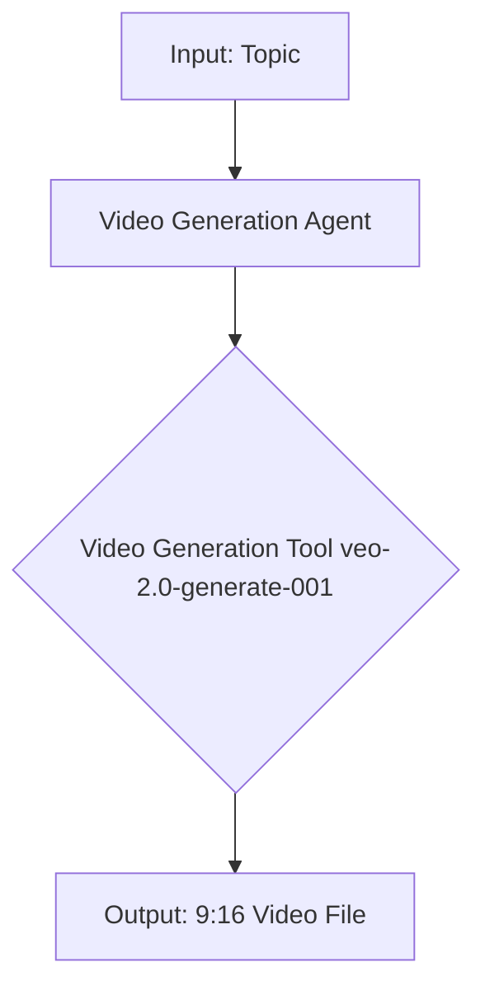

# Design Document

## Overview

This document outlines the technical design for the video generation crew. The crew will be a self-contained module within the `3_crew` monorepo, responsible for generating a short, iconography-based video from a given topic.

## Steering Document Alignment

### Technical Standards (tech.md)
The design will follow the established technical standards of the `3_crew` project, including the use of Python, crewAI, Pydantic, and `uv` for dependency management.

### Project Structure (structure.md)
The implementation will adhere to the project's standardized directory structure, with the new crew residing in a `video_generation_crew` subdirectory and containing its own `src`, `config`, and `tools` directories.

## Code Reuse Analysis
As this is a new crew with a distinct function, there is limited opportunity for code reuse from the existing crews. However, the overall structure and patterns (e.g., YAML configuration, `main.py` entry point) will be replicated.

## Architecture

The video generation crew will consist of a single agent with a specialized tool for video creation. This approach is simpler than a multi-agent pipeline, as the core task is a single, well-defined creative generation process.

## Components and Interfaces

### Video Generation Agent
- **Purpose:** To take a topic and generate a video that visually represents it.
- **Interfaces:** The agent will be invoked via the `crew.py` file and will have a single task: to generate the video.
- **Dependencies:** This agent will depend on the Video Generation Tool.

### Video Generation Tool
- **Purpose:** To interact with a video generation model (e.g., `veo-2.0-generate-001`) to create the video.
- **Interfaces:** The tool will have a `_run` method that takes a detailed prompt as input and returns the path to the generated video file.
- **Dependencies:** This tool will require an API key for the video generation service.

## Data Models

No new complex data models are required for this initial version. The input will be a simple dictionary containing the topic, and the output will be the path to the video file.

## Error Handling

### Error Scenarios
1. **Scenario:** The video generation API returns an error.
   - **Handling:** The tool will catch the exception and log a clear error message.
   - **User Impact:** The user will be notified that the video generation failed.

2. **Scenario:** The generated video does not meet the specified requirements (e.g., wrong aspect ratio).
   - **Handling:** This is a risk with generative models. The initial version will not have a validation step, but this could be added in the future.
   - **User Impact:** The user may need to re-run the crew or manually edit the video.