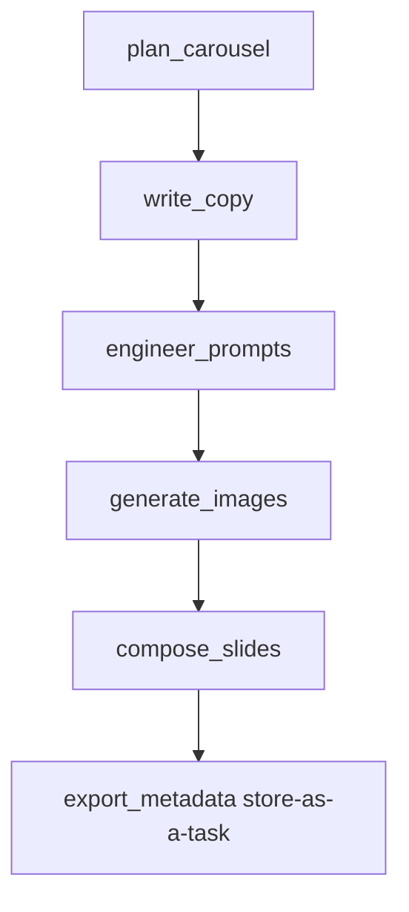

# Instagram Carousel Generator - Execution Plan

Objectives
- Generate 7-slide educational Instagram carousel from a topic
- Text-first copy with brand overlays on AI images
- Brand style: primary #000000, secondary #FFFFFF, Inter font, logo bottom-right
- Integrate into 3_crew/content and store final artifacts as a task output

Scope and deliverables
- New pipeline with agents and tasks inside CrewAI project
- Exported assets: 7 PNG slides at 1080x1350, metadata.json, caption.txt, prompts.json
- Deterministic directory per carousel slug under output/carousels/{slug}

Output structure
- 3_crew/content/output/carousels/{slug}/
  - slides/slide_01.png … slide_07.png
  - metadata.json
  - caption.txt
  - prompts.json

Data models
- BrandConfig: primary_hex, secondary_hex, font_path, logo_path, margins
- SlideText: index, title, body, cta
- CarouselPlan: topic, slide_count, slides List[SlideText]
- ImagePromptSpec: slide_index, prompt
- ExportMetadata: slug, topic, slide_count, caption, hashtags, alt_texts, files

Pipeline overview

Dependencies to add in pyproject
- openai &#62;= 1.30.0
- pillow &#62;= 10.2.0
- pydantic &#62;= 2.7.0
- python-slugify &#62;= 8.0.0

New files to create
- 3_crew/content/src/content/types.py
  - Pydantic models: BrandConfig, SlideText, CarouselPlan, ImagePromptSpec, ExportMetadata
- 3_crew/content/src/content/tools/openai_images.py
  - GenerateImageTool: wraps OpenAI Images API gpt-image-1
- 3_crew/content/src/content/tools/composer.py
  - ComposeSlideTool: overlay title and body using PIL, InterVariable.ttf, place logo bottom-right
- 3_crew/content/src/content/tools/brand.py
  - Helpers load_brand, load_font
- 3_crew/content/src/content/tools/io_utils.py
  - Helpers ensure_dirs, slugify_topic, write_json, write_text
- 3_crew/content/src/content/tools/templates.py
  - Prompt builders outline_prompt, slide_copy_prompt, image_prompt_prompt

YAML changes
- 3_crew/content/src/content/config/agents.yaml
  - Add agents: carousel_planner, copywriter, image_prompt_engineer, compositor
- 3_crew/content/src/content/config/tasks.yaml
  - Add tasks: plan_carousel, write_copy, engineer_prompts, generate_images, compose_slides, export_metadata
  - Set export_metadata.output_file to output/carousels/{slug}/metadata.json to store as task artifact

Crew wiring
- Update 3_crew/content/src/content/crew.py
  - Add four @agent methods and attach relevant tools
  - Add six @task methods in sequential order and keep Process.sequential

Entrypoint updates
- Update 3_crew/content/src/content/main.py
  - Accept inputs: topic, slide_count default 7, brand_logo, brand_font, primary, secondary, output_dir
  - Pass inputs through Content().crew().kickoff

Prompt design guidelines
- Outline prompt: 7-slide arc with hook, value slides, CTA
- Copy prompt: max 25 words body, plain language, educational tone, CTA on slide 7
- Image prompt: scene, subject, style, lighting, color mood, explicitly no text in image

Image generation and rendering
- Model: gpt-image-1 at 1024x1024
- Canvas: convert to 1080x1350 by fit or pad; maintain brand background for padding
- Composition: title top, body middle, consistent margins, logo bottom-right

Testing and acceptance
- Run once with topic How Compound Interest Works
- Verify output folder exists with 7 PNGs at 1080x1350, metadata.json, caption.txt, prompts.json
- Confirm Crew task stores metadata.json as output_file artifact

Risks and mitigations
- Font not found: fallback to default PIL font and log a warning
- Image contains text: reinforce no text in prompt and optionally use style keywords to avoid typographic renderings
- Long copy truncation: enforce word counts and reflow text with wrapping and ellipsis

Implementation sequence checklist
1 Add dependencies to pyproject
2 Create new tools and types modules
3 Extend agents and tasks YAML
4 Wire agents and tasks in crew.py
5 Update main.py input handling
6 Add assets paths and run a test
7 Review outputs and iterate on prompts
---
title: Execution Plan Blueprints
---

This appendix adds concrete YAML blueprints, prompt templates, tool I/O contracts, and storage-as-a-task details to guide implementation.

File touchpoints
- 3_crew/content/src/content/config/agents.yaml
- 3_crew/content/src/content/config/tasks.yaml
- 3_crew/content/src/content/crew.py
- 3_crew/content/src/content/main.py
- 3_crew/content/src/content/tools/
- 3_crew/content/src/content/types.py

Inputs passed to the crew
- topic: string, e.g., How Compound Interest Works
- slide_count: integer, default 7
- primary_hex: string, default #000000
- secondary_hex: string, default #FFFFFF
- brand_logo: path, e.g., 3_crew/content/assets/logo.png
- brand_font: path, e.g., 3_crew/content/assets/fonts/InterVariable.ttf
- output_base: path, e.g., 3_crew/content/output/carousels
- slug: precomputed slug slugify(topic), passed to tasks for artifact paths

YAML blueprint: agents.yaml additions
carousel_planner:
  role: >
    {topic} Carousel Planner
  goal: >
    Design a {slide_count}-slide educational carousel with a strong hook, logical progression, and a clear CTA on the last slide.
  backstory: >
    You transform complex topics into scannable multi-slide outlines optimized for Instagram consumption.

copywriter:
  role: >
    {topic} Carousel Copywriter
  goal: >
    Write concise, scannable copy per slide (title + body + optional CTA) with strict brevity limits.
  backstory: >
    You specialize in social copy that is clear, jargon-light, and educational.

image_prompt_engineer:
  role: >
    {topic} Image Prompt Engineer
  goal: >
    Craft visually coherent prompts for gpt-image-1 that reinforce the learning objective without text in the image.
  backstory: >
    You translate messaging into visual scenes: subject, style, lighting, mood, composition.

compositor:
  role: >
    Brand Compositor
  goal: >
    Apply brand overlays, layout rules, and export final slides at 1080x1350, logo bottom-right.
  backstory: >
    You ensure readability, contrast, and consistent brand presence.

YAML blueprint: tasks.yaml additions
plan_carousel:
  description: >
    Given the topic "{topic}" and slide_count "{slide_count}", produce a JSON outline for an educational IG carousel.
    Include exactly slide_count slides with fields: index (1-based), title, bullets (2-4 bullet points).
  expected_output: >
    JSON with fields: { "slides": [ { "index": int, "title": str, "bullets": [str, ...] } ] }
  agent: carousel_planner

write_copy:
  description: >
    Using the outline from plan_carousel, write final per-slide copy.
    For each slide, output: index, title (<= 8 words), body (<= 25 words, single paragraph), cta (only on the last slide).
    Tone: educational, clear, concise; avoid jargon and clickbait. No hashtags here.
  expected_output: >
    JSON: { "slides": [ { "index": int, "title": str, "body": str, "cta": str|null } ] }
  agent: copywriter

engineer_prompts:
  description: >
    For each slide, produce a visual prompt suitable for gpt-image-1 that reinforces the slide message without embedding text.
    Specify subject, setting, style, lighting, color mood; avoid typography and words.
    Respect brand: high contrast that works with black/white overlays.
  expected_output: >
    JSON: { "prompts": [ { "index": int, "prompt": str } ] }
  agent: image_prompt_engineer

generate_images:
  description: >
    For each engineered prompt, call the image generation tool to create a 1024x1024 image and save to:
    "output/carousels/{slug}/raw/slide_{index_padded}.png". Return the list of saved paths.
  expected_output: >
    JSON: { "raw_images": [ { "index": int, "path": str } ] }
  agent: compositor

compose_slides:
  description: >
    Compose final slides at 1080x1350 using the brand overlays (Inter font), white-on-black or black-on-white as needed.
    Place the title near the top, body in the middle, logo at bottom-right, with safe margins.
    Save to: "output/carousels/{slug}/slides/slide_{index_padded}.png". Return the list of saved paths.
  expected_output: >
    JSON: { "slides": [ { "index": int, "path": str } ] }
  agent: compositor

export_metadata:
  description: >
    Create export metadata for the carousel including caption, hashtags, alt_text per slide, and file paths.
    Save metadata.json and caption.txt under "output/carousels/{slug}/".
  expected_output: >
    metadata.json
  output_file: "output/carousels/{slug}/metadata.json"
  agent: compositor

Prompt templates (for implementation in templates.py)

Outline prompt (for carousel_planner)
- Instruction: Create {slide_count} slide outline for topic "{topic}" with a hook on slide 1, value slides in 2-6, and a CTA on slide 7.
- Constraints:
  - Slide title <= 8 words
  - 2-4 bullets per slide, each <= 12 words
  - Educational tone, clear, no jargon
- Output: JSON schema as in plan_carousel expected_output

Copy prompt (for copywriter)
- Instruction: Convert the outline into final copy with constraints.
- Constraints:
  - Body <= 25 words, single paragraph
  - Title may be same or refined, <= 8 words
  - CTA only on last slide, concise (<= 12 words)
  - Avoid emojis and hashtags
- Output: JSON schema as in write_copy expected_output

Image prompt prompt (for image_prompt_engineer)
- Instruction: For each slide, produce a visual prompt that supports the message without embedded text.
- Include:
  - Subject, setting, composition, style (e.g., modern, minimal), lighting, color mood
  - Fit for black/white overlay; avoid busy backgrounds
  - Explicitly: "No text, no typography, no watermarks"
- Output: JSON schema as in engineer_prompts expected_output

Tool I/O contracts (for tools module)

GenerateImageTool
- Purpose: Create image from a single prompt and save to a given path.
- Inputs: prompt: str; save_path: str; size: "1024x1024"
- Output: save_path string if saved successfully

ComposeSlideTool
- Purpose: Composite text over an image to create 1080x1350 final slide with brand elements.
- Inputs:
  - image_path: str (raw image)
  - title: str
  - body: str
  - cta: Optional[str]
  - index: int
  - brand: { primary_hex, secondary_hex, font_path, logo_path, margins }
  - save_path: str
- Output: save_path string if saved successfully
- Behavior:
  - Load InterVariable.ttf if available; fallback to default
  - Wrap body to fit safe width; truncate with ellipsis if needed
  - Place logo bottom-right within safe margin; maintain opacity 100%

Storage as a task artifact
- export_metadata task sets:
  - output_file: "output/carousels/{slug}/metadata.json"
- Ensure main passes "slug" in inputs so YAML interpolation resolves correctly.
- Crew run will capture output_file as the stored task artifact.

Run example (after implementation)
- Command: crewai run
- Inputs in main:
  - topic: "How Compound Interest Works"
  - slide_count: 7
  - brand_logo: "3_crew/content/assets/logo.png"
  - brand_font: "3_crew/content/assets/fonts/InterVariable.ttf"
  - primary_hex: "#000000"
  - secondary_hex: "#FFFFFF"
  - output_base: "3_crew/content/output/carousels"
  - slug: "how-compound-interest-works"

Acceptance checklist (planning)
- 7 PNGs at 1080x1350 under output/carousels/{slug}/slides
- metadata.json, caption.txt, prompts.json present under output/carousels/{slug}
- export_metadata.output_file equals output/carousels/{slug}/metadata.json
- Readability: sufficient contrast, margins, no text in base AI images